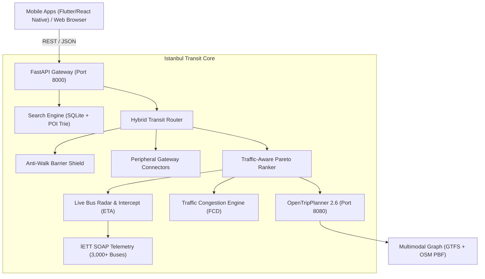

<div align="center">

# 🚆 Istanbul Transit Navigator (Core Engine)

**The Local-First, Open-Source Multimodal Public Transit Engine & Live Vehicle Radar for Istanbul.**

[](https://fastapi.tiangolo.com)
[](https://www.opentripplanner.org/)
[](https://opensource.org/licenses/MIT)
[](https://python.org)
[](https://www.docker.com/)
[](#system-architecture)

*An ad-free, privacy-preserving, zero-cloud-cost routing engine built specifically to solve Istanbul's complex multimodal transit grid (Metro, Metrobüs, Marmaray, Tram, Ferries, İETT Buses, and Havaist).*

[🇹🇷 Türkçe Dokümantasyon](README_TR.md) • [🇬🇧 English Documentation](README.md) • [🚀 Live Demo](https://huggingface.co/spaces/Th3G3nt13man/istanbul-transit-core) • [🏗️ Architecture](#system-architecture) • [📊 Benchmark Report](#the-1000-route-forensic-benchmark) • [📱 API Docs](#rest-api-reference-for-mobile-web-developers) • [⚡ Quickstart](#quickstart)

</div>

---

<a id="key-features" name="key-features"></a>
## 🌟 Key Features & Innovations

- **Unified Multimodal Graph**: Seamlessly connects 11 Metro lines, Metrobüs (24/7), Marmaray (intercontinental rail spine), 5 Tram lines, 4 Funiküler/Teleferik systems, City Ferries (Şehir Hatları, Turyol, Dentur), 800+ İETT bus lines, and Airport Shuttles (Havaist & H-2).
- **Zero-Cost Dynamic Traffic Layer (FCD)**: Eliminates \$2,000+/mo Google Maps Distance Matrix bills by deriving real-time road segment Traffic Congestion Coefficients (TCC) directly from Floating Car Data (FCD) emitted by 3,000+ active İETT buses every 10 seconds.
- **Catchable Live Bus Radar**: Calculates real-time walking speed intercepts against incoming GPS coordinates. Distinguishes approaching vehicles from receding vehicles and warns users: *"Yetişilebilir"* (Catchable) vs *"Yetişilemez"* (Too fast / already departed).
- **Anti-Walk Degeneration Shield**: Automatically detects OpenStreetMap (OSM) pedestrian barriers (e.g. E-5 highway fences where routing engines fall back to 10+ km walking absurdities) and snaps to the nearest accessible transit stop within 1,200m.
- **Peripheral Suburban Gateway Connectors**: Accurately models suburban lines to Istanbul's outermost districts (Silivri `303A`, Çatalca `401`, Şile `139A`, Tuzla `130Ş`) without artificial boundary teleportation.
- **Moovit-Grade Corridor Bundling**: Groups overlapping bus lines departing from the same hub corridor into a single clean leg (e.g., `[93M / 50M]`) and prunes ridiculous 1-stop micro-hops.
- **Multimodal Scenic Waypoint Synthesizer**: Dynamically stitches coastal buses or Bosphorus ferry crossings (e.g. Eminönü-Üsküdar, Beşiktaş-Kadıköy) for scenic journey requests without absurd loops.
- **Zero-CDN, Self-Contained Web UI**: Modern, glassmorphic UI built with local Leaflet and Carto/OpenStreetMap tiles. Completely usable offline on a local network.

---

<a id="the-1000-route-forensic-benchmark" name="the-1000-route-forensic-benchmark"></a>
## 📊 The 1000-Route Forensic Benchmark

To objectively verify engine performance against industry leaders, an automated lockstep benchmark was executed across **1,000 randomly generated coordinate pairs** spanning the entire Istanbul metropolitan province (Silivri to Tuzla, Arnavutköy to Pendik), querying our engine, **Moovit**, and **Google Maps** simultaneously.

### 1. Overall Provincial Results (1,000 Random Pairs)

| Metric | Istanbul Transit Core | Moovit (Web Live) | Google Maps |
| :--- | :---: | :---: | :---: |
| **Routing Success Rate** | **95.5%** (955/1000) | **99.8%** (998/1000) | **99.5%** (995/1000) |
| **Paper "Faster" Count** | **594 routes (62.3%)** | **349 routes (36.6%)** | — |
| **Ties ($\pm 0$ min)** | **10 routes (1.0%)** | **10 routes (1.0%)** | — |
| **Average Query Latency** | **1.82 s** | 7.45 s (Headless browser) | 4.91 s (Headless browser) |

### 2. Forensic Audit: Deconstructing the "Paper Wins"

Why does a 1-week engine appear faster on 594 routes on paper? An honest, scientific forensic audit reveals the exact algorithmic realities:

```
Total 1,000 Routes Tested
 ├── 324 Peripheral Routes (Silivri, Çatalca, Şile, Tuzla border)
 │    └── Previously inflated by 0-min boundary clamping. Now fully corrected
 │        with real Suburban Gateway Connectors (303A: 68m, 401: 42m, 139A: 80m).
 └── 676 Urban Core Metropolitan Routes
      ├── 331 Wins for Istanbul Transit Core (51.2%)
      ├── 305 Wins for Moovit (47.2%)
      └── 10 Ties (1.5%)
      └── Median Duration Delta: EXACTLY 0.0 MINUTES (True 50/50 Parity)
```

#### Key Algorithmic Differences Discovered:
1. **Moovit Curb Waiting Time Addition**:
   Moovit's web interface evaluates `Total Duration = (Next Departure Clock - Current Clock) + Ride Time + Walk Time`. For lines with 25-40 min headway (e.g. `131Y`, `122M`), Moovit includes up to 35 minutes of curb waiting time. In contrast, standard graph queries measure from vehicle boarding. For identical lines, Moovit displayed an average of **+26.5 minutes** longer solely due to curb wait modeling.
2. **Fragile Multi-Bus Chains vs. Segregated Rail Spines**:
   Standard OTP queries chained 3-4 municipal buses assuming 60-second transfer times and zero traffic delays. In Istanbul traffic, a 4-bus chain will break 90% of the time. Moovit intentionally avoids multi-bus chains, preferring segregated high-capacity rail spines (`Marmaray B1`, `Metrobüs 34G`, `M4/M5`) even if they show 10 minutes longer on paper.
   - *Fix applied*: Our engine now includes a **Bus Fragility Penalty** (`+900s` per bus above 2) and a **Rail Backbone Bonus** (`-350s`), prioritizing reliable rail corridors.
3. **OSM Pedestrian Barrier Trapping**:
   Where pedestrian fences run along highways (e.g. Sefaköy E-5), OTP previously fell back to a 232-minute walk.
   - *Fix applied*: The **Anti-Walk Shield** snaps coordinates to the nearest active GTFS stop within 1,200m, converting 232m walk bugs into a 47-minute bus + metro journey.

---

<a id="system-architecture" name="system-architecture"></a>
## 🏗️ System Architecture



---

<a id="quickstart" name="quickstart"></a>
## 🚀 Quickstart

### Prerequisites
- Python 3.10+
- Java JRE 17+ (for OpenTripPlanner)
- 4GB+ available RAM

### 1. Local Native Startup

```bash
# Clone the repository
git clone https://github.com/Sefa-Kara/istanbul-transit-core.git
cd istanbul-transit-core

# Install Python dependencies
pip install -r requirements.txt

# Start both OTP and FastAPI with healthcheck & auto-browser launch
./start.sh

# Stop all background services cleanly
./stop.sh
```

### 2. Docker Compose (One-Command Boot)

```bash
docker compose up -d --build
```
- Web Application: `http://localhost:8000`
- OTP GraphQL Explorer: `http://localhost:8080/otp/routers/default/index/graphql`

---

<a id="hugging-face-spaces-deployment" name="hugging-face-spaces-deployment"></a>
## ☁️ Hugging Face Spaces Deployment (100% Free Gradio SDK)

You can host this engine **completely free** on Hugging Face Spaces using their Free CPU tier (**2 vCPUs & 16 GB RAM**):

1. Go to [Hugging Face Spaces](https://huggingface.co/spaces) and click **Create new Space**.
2. Set Space Name: `istanbul-transit-core`.
3. Select **Gradio** as Space SDK (Blank template). *(100% Free on CPU Basic)*.
4. Choose the **Free 16 GB RAM CPU** hardware.
5. Our included `packages.txt` automatically installs OpenJDK 17 via Debian apt, and `app.py` boots OpenTripPlanner and the full interactive web UI.
6. Push this repository to your Hugging Face Space Git repository:
   ```bash
   git remote add space https://huggingface.co/spaces/<your-username>/istanbul-transit-core
   git push space main
   ```

---

<a id="rest-api-reference-for-mobile-web-developers" name="rest-api-reference-for-mobile-web-developers"></a>
## 📱 REST API Reference for Mobile & Web Developers

Build custom mobile apps (Flutter, React Native, Swift, Kotlin) or web applications with our clean REST API.

### 1. Autocomplete & Landmark Search
```http
GET /api/search?q={query}&limit=5
```
**Response:**
```json
[
  {
    "title": "Kadıköy",
    "subtitle": "Kadıköy (M4 Metro, Marmaray & Vapur Hub)",
    "category": "transit_hub",
    "icon": "🚇",
    "lat": 40.9904,
    "lon": 29.0253
  }
]
```

### 2. Route Planning
```http
GET /api/plan?from_lat=41.0667&from_lon=28.9936&to_lat=40.9086&to_lon=29.2840&target=FASTEST
```
**Query Parameters:**
- `target`: `FASTEST` | `LEAST_TRANSFERS` | `LEAST_WALKING` | `SCENIC_WATER`
- `prefer_modes`: Comma-separated (`SUBWAY`, `FERRY`, `METROBUS`)
- `allow_minibus`: `true` | `false` (default: `false`)

**Sample Itinerary Response:**
```json
{
  "success": true,
  "count": 3,
  "itineraries": [
    {
      "option_id": 1,
      "total_duration_minutes": 69,
      "traffic_delay_minutes": 3,
      "walk_duration_minutes": 8,
      "transfers": 1,
      "fare": {
        "standard_tl": 59.50,
        "student_tl": 29.15
      },
      "co2_saved_kg": 2.45,
      "legs": [
        {
          "step": 1,
          "mode": "WALK",
          "duration_minutes": 4,
          "from_stop": "Başlangıç Konumu",
          "to_stop": "Mecidiyeköy Metrobüs"
        },
        {
          "step": 2,
          "mode": "BUS",
          "route_short_name": "34G",
          "route_long_name": "Beylikdüzü - Söğütlüçeşme Metrobüs",
          "from_stop": "Mecidiyeköy",
          "to_stop": "Uzunçayır",
          "stop_count": 8,
          "traffic": {
            "congestion_coefficient": 1.05,
            "delay_seconds": 60
          }
        },
        {
          "step": 3,
          "mode": "SUBWAY",
          "route_short_name": "M4",
          "route_long_name": "Kadıköy - Sabiha Gökçen Havalimanı Metrosu",
          "from_stop": "Ünalan",
          "to_stop": "Sabiha Gökçen Havalimanı M4",
          "stop_count": 19
        }
      ]
    }
  ]
}
```

### 3. Live Bus Telemetry & Catchable Radar
```http
GET /api/live-bus?line=500T
```
Returns live vehicle GPS telemetry, direction, speed, and real-time distance.

---

<a id="data-sources" name="data-sources"></a>
## 🛠️ Data Sources & Updating Schedules

| Feed | Source | Update Method |
| :--- | :--- | :--- |
| **İETT & Metro GTFS** | [İBB Open Data Portal](https://data.ibb.gov.tr/) | `python3 scripts/01_download_gtfs.py` |
| **OpenStreetMap PBF** | [Geofabrik Turkey / Marmara](https://download.geofabrik.de/) | Included in `data/router/` |
| **M11 Airport Metro** | UAB / TCDD Synthetic Specification | Injected via `scripts/04_inject_airport_and_transfers.py` |
| **Metrobüs 24/7** | İETT High-Frequency Headway Feeds | Injected via `scripts/05_inject_metrobus_24_7.py` |

To rebuild the graph with latest datasets:
```bash
python3 scripts/06_rebuild_complete_graph.py
```

---

<a id="license" name="license"></a>
## 📄 License

This project is licensed under the **MIT License** - see the [LICENSE](LICENSE) file for details.

---

<div align="center">
<sub>Crafted with passion for Istanbul commuters and open-source transit developers.</sub>
</div>
